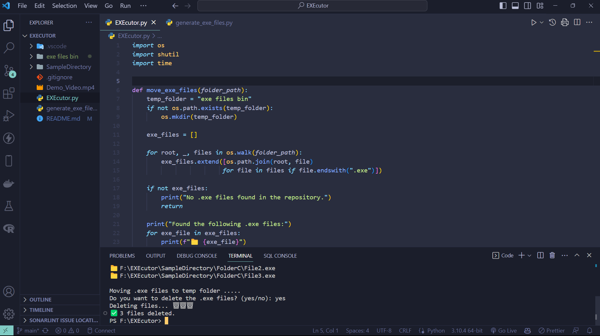

# EXEcutor

EXEcutor helps you manage executable files in your repository. It identifies `.exe` files, moves them to a temporary folder, and deletes them with your confirmation.

## Usage

The EXEcutor script (`EXEcutor.py`) and the `generate_exe_files.py` script work together to showcase the functionality. The generate_exe_files.py script generates a sample directory structure with .exe files, and the EXEcutor.py script manages these files based on user input.

## Demonstration Video

Click on the thumbnail below to watch the demonstration video on YouTube.

[](https://youtu.be/4UESBu3zZls)

## Steps

1. **Generate Sample Directory Structure**

   Run `generate_exe_files.py` to create a sample directory structure with .exe files. This step is necessary before running the EXEcutor.py script.

   ```bash
   python generate_exe_files.py
   ```

   Sample exe files will be generated in the "SampleDirectory" folder.

2. **Run EXEcutor Script**

   Run `EXEcutor.py` to manage the .exe files generated in the previous step.

   ```bash
   python EXEcutor.py
   ```

   The script will:

   - List the found .exe files.
   - Move .exe files to a temporary folder.
   - Optionally delete the .exe files with your confirmation.

   During the process, you will see progress animations and emojis indicating the actions taken.
